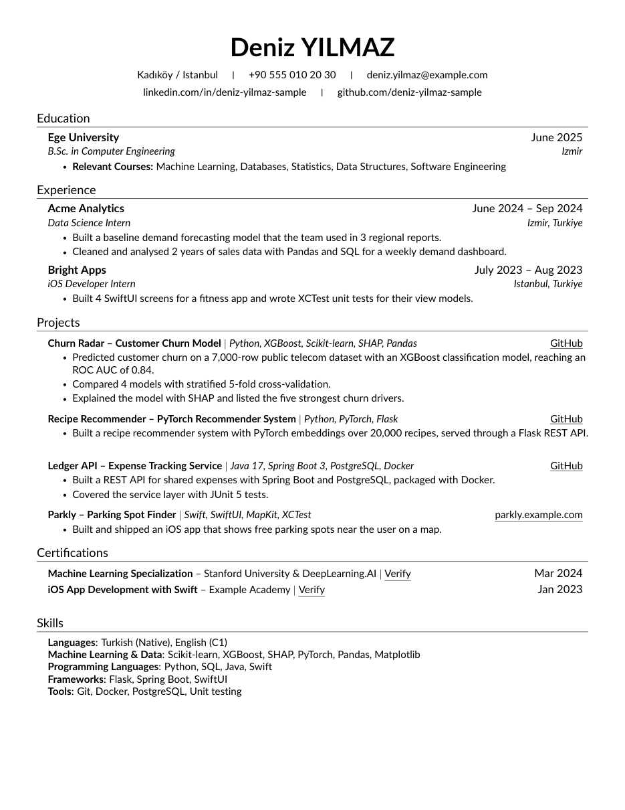
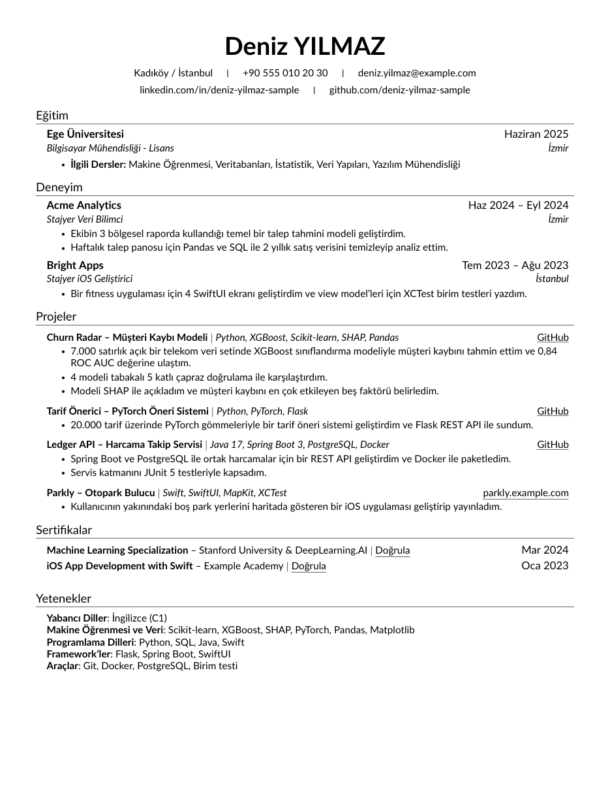
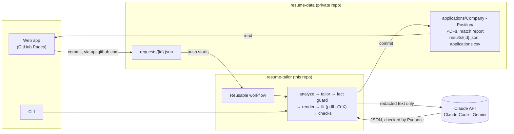

# Resume Tailor

Paste a job posting; get **two one-page PDF resumes tailored to it** (English and
Turkish), generated from your own LaTeX resume, plus a keyword match report and, if you
want one, a cover letter. It runs from a phone or a PC, on GitHub Actions, with your data
in a private repo.

- **Truthful by construction.** The model only selects, reorders and rephrases what is in
  your `career-inventory.md`. A deterministic fact guard rejects any number, skill,
  technology or project the inventory cannot back, before anything is rendered.
- **Your layout, untouched.** The model never writes LaTeX. Python renders your own
  macros, and a round-trip test proves the renderer reproduces your base resume exactly.
- **One page, always.** Both languages are compiled with pdfLaTeX and fitted *together*
  by dropping the lowest-priority content, never by shrinking fonts or margins.
- **Private.** Your name, contact details and links never reach an LLM provider: they are
  redacted, and the call aborts if anything personal survives.
- **Cheap and capped.** A run costs about $0.10–0.15, every call is logged with its exact
  cost, and a monthly budget switches to a free fallback instead of overspending.

| English resume | Turkish resume | Cover letter |
|---|---|---|
|  |  |  |

*Generated from the fictional person in [`sample-data/`](sample-data/) with
`tailor run --dry-run --cover-letter both`.*

## How it works



1. **Analyze.** A small model reads the posting: company, position, must-haves, keywords.
2. **Tailor.** The tailoring model picks, orders and rephrases content from your
   inventory, and returns JSON that cites an inventory section for every bullet.
3. **Fact guard.** Code checks every number, skill, technology, project and status
   against the cited sources. One repair round, then the run fails with the list.
4. **Render and fit.** Python escapes the text into your own LaTeX macros; pdfLaTeX
   compiles both languages, which are fitted to one page together.
5. **Check and publish.** One page each, a clean ATS text layer, keyword coverage; then
   the PDFs, the report and a log row are committed to your data repo.

## Set up in 10 minutes

1. **Fork or clone** this repo, and install Python 3.12+ and TinyTeX (see
   [TinyTeX](#tinytex)). `pip install -e .` gives you the `tailor` command.
2. **Make your data folder:** `gh repo create resume-data --private`, then
   `tailor init-data-repo ../resume-data`. Replace the fictional sample with your own
   `base/en`, `base/tr`, `career-inventory.md` and `config.yml`, and run
   `tailor check --data-dir ../resume-data` until it passes.
3. **Buy a few dollars of Claude API credits** and store the key as the data repo's
   `ANTHROPIC_API_KEY` secret ([Setting up the Claude API](#setting-up-the-claude-api)).
4. **Push the data repo** to GitHub.
5. **Open the web app**, enter the repo and a fine-grained token
   ([The web app](#the-web-app-pc-and-iphone)), paste a posting, and tailor.

Steps 2 and 3 are the only ones that take thought: the inventory is where every fact you
may claim lives, and it is worth writing carefully once.

## Quick start (CLI)

Needs Python 3.12+ and pdfLaTeX (TinyTeX recommended; see below).

```bash
pip install -e .
tailor check --data-dir sample-data                 # validate + test-compile the sample
tailor run --data-dir sample-data --dry-run --posting sample-data/fixtures/posting.txt
```

`--dry-run` replays a recorded LLM answer, so it costs nothing. With your own data:

```bash
tailor run --data-dir ../resume-data --posting posting.txt          # or .pdf, or - for stdin
tailor run --data-dir ../resume-data --posting posting.txt --company "ABC" --position "Veri Bilimci" --note "emphasize iOS"
tailor run --data-dir ../resume-data --posting posting.txt --cover-letter both   # en, tr or both
tailor run --data-dir ../resume-data --regenerate <request-id> --note "lead with iOS"
tailor preset list  --data-dir ../resume-data
tailor preset build --data-dir ../resume-data --stale               # only outdated presets
tailor keys list                                                    # which API keys are set (masked)
```

Output lands in `Desktop/Job Applications/<Company> - <Position>/` (OneDrive-redirected
Desktops are handled), and a full copy with the `.tex` sources goes to the data repo.

### Your data folder

```
resume-data/
  base/en/  resume.tex  custom-commands.tex  src/{heading,education,experience,projects,certificates,skills}.tex
  base/tr/  (same structure, Turkish)
  career-inventory.md     every fact you may claim (format: sample-data/career-inventory.md)
  config.yml              owner, providers, models, prices, budget (sample-data/config.yml)
  presets.yml             role-family presets
```

### TinyTeX

Windows (PowerShell): download and run the official installer from
<https://yihui.org/tinytex/>, then install the packages in
[.github/actions/setup-tinytex/packages.txt](.github/actions/setup-tinytex/packages.txt):

```powershell
tlmgr install babel-english babel-turkish cm-super enumitem fancyhdr fontawesome5 fontaxes lato marvosym mweights preprint titlesec
```

XeLaTeX, LuaLaTeX and Tectonic are not supported: the template uses pdfTeX primitives
that keep the PDF text layer clean for applicant-tracking systems.

## The web app (PC and iPhone)

<https://bedirhankaraahmetli.github.io/resume-tailor/> is a static page. It holds no data
and talks to nothing but `api.github.com`, using a token you give it for your own private
data repo.

1. **Create a fine-grained token** on GitHub: Settings → Developer settings → Personal
   access tokens → Fine-grained tokens → Generate new token.
   - **Expiration:** 90 days or less.
   - **Repository access:** Only select repositories → your private `resume-data`.
   - **Permissions:** Contents: Read and write; Actions: Read-only. Optionally,
     Secrets: Read and write, which lets the page manage your API keys.
2. **Open the page → Settings.** Enter the repo, the token and a passphrase. The token is
   encrypted with the passphrase (PBKDF2 → AES-GCM) before it is stored. The decrypted
   copy lives only in the tab's session, so you type the passphrase once per session.
3. **New.** Paste a posting, or load a `.txt` or `.pdf` file; its text is extracted in
   the browser. The page commits a request file and shows the live status: queued →
   analyzing → tailoring → compiling → done.
   Choose a **cover letter** in English, Turkish or both, or none.
4. **Result.** You get both PDFs (previews and downloads) and the match report.
   - **Chrome or Edge on Windows:** **Save to folder** asks once for your
     `Job Applications` folder, remembers it, and writes `<Company> - <Position>/` there.
   - **iPhone:** **Share or save to Files** opens the share sheet.
   - **Regenerate with a note** at the bottom of the result tailors it again ("lead with
     the iOS projects"). It reuses the posting analysis and replaces the files in place.
5. **Quick apply** lists the presets with their status (up to date, outdated or never
   built). From there you can open, rebuild, save or log an application.
6. **History** shows `applications.csv`. Change an application's status (applied,
   interview, offer, rejected) or delete it; each change is one commit.
7. **Settings → Skills** adds a skill with its Turkish name and evidence to your
   inventory and `config.yml` in one commit, after checking it against duplicates and
   your "never claim" list.

**Why the passphrase:** every GitHub Pages site of one account shares one origin, and so
one `localStorage`. Any other Pages project on the account could read a token stored there
in plain text. A strict Content-Security-Policy (`connect-src https://api.github.com`)
means the page cannot send the token anywhere else.

## LLM providers and what they cost

Three providers, tried in the order set in `config.yml`. Each is skipped if it has no
credentials:

| Provider | Paid by | Notes |
|---|---|---|
| `anthropic` (default) | **Claude API prepaid credits** | Best quality. Each run's exact cost is in the report and `applications.csv` |
| `claude-code` | **Your Claude Pro subscription** (Claude Code, headless) | Counts against Pro usage limits, not API credits |
| `gemini` | **Gemini API free tier** | Rate-limited; free-tier data may be used by Google. Redaction protects your contact details |

**Plain facts about billing:**

- The **Claude API is billed separately from a Claude Pro subscription**. It is prepaid:
  you buy credits, they **expire one year after purchase** and are non-refundable. With
  **auto-reload off**, the balance is a hard spending cap. (Max and Team plans include
  monthly API credits that expire at the end of each billing cycle.)
- The `claude-code` provider uses the **Pro subscription** instead of API credits.
- A **Google AI Pro (Google One) subscription does not include Gemini API usage**. The
  free tier is a separate, rate-limited offer, and its data terms differ from paid use.

A typical run costs about **$0.10–0.15** on `claude-sonnet-5-5`, so a `monthly_budget_usd`
of 5 covers roughly 30–45 applications. A cover letter adds about $0.05, or $0.08 when it needs a
repair round (one language saves about $0.01; the inventory it reads is most of the cost), and a regenerate
costs one tailoring call, about $0.05–0.10. Before each run, a budget guard sums this
month's spend in `usage.csv`. If the run would exceed the budget, it skips the Claude API
and uses the next provider. When credits run out, the tool says so and falls back the
same way.

### Setting up the Claude API

1. Create a Claude Console account at <https://platform.claude.com>.
2. **Settings → Billing → Buy credits** (for example $10). Leave **auto-reload off**.
   Credits expire one year after purchase and are non-refundable.
3. Create an API key in a dedicated workspace named `resume-tailor`.
4. Store it with `tailor keys set anthropic` (hidden input, checked with a free call,
   saved to a local `.env` that is never committed). Add `--github OWNER/resume-data` to
   store it as that repo's Actions secret too; the value goes to `gh` over stdin only.

## Running it on GitHub Actions

Your data lives in a **private** repo (`resume-data`). Pushing a request file there runs
this repo's reusable workflow, which commits the PDFs, the report and
`results/<id>.json` back.

1. **Create the private repo and scaffold it.** This never overwrites a file; on an
   existing data folder it only adds what is missing:

   ```bash
   gh repo create resume-data --private
   tailor init-data-repo ../resume-data          # pins the workflow to this checkout's commit
   ```

   It writes `.github/workflows/tailor.yml`, `requests/`, `results/`, a `.gitignore`
   and, if missing, a fictional sample `config.yml`, inventory and base resumes to replace.
   To move to a newer tool version later:
   `tailor init-data-repo ../resume-data --update-workflow --tool-ref <commit>`.

2. **Add the secrets** (resume-data → Settings → Secrets and variables → Actions):

   | Secret | Needed? | How to get it |
   |---|---|---|
   | `ANTHROPIC_API_KEY` | Yes, for the default provider | See *Setting up the Claude API*; `tailor keys set anthropic --github OWNER/resume-data` |
   | `CLAUDE_CODE_OAUTH_TOKEN` | Optional fallback | Run `claude setup-token` locally (Pro/Max plan), then `gh secret set CLAUDE_CODE_OAUTH_TOKEN --repo OWNER/resume-data` and paste it at the hidden prompt |
   | `GEMINI_API_KEY` | Optional fallback | <https://aistudio.google.com/apikey>; `tailor keys set gemini --github OWNER/resume-data` |

   Never paste a key into a file in either repo, an issue or a chat. The workflow passes
   keys only to the two steps that call a provider and never prints them.

3. **Make a request** from the web app (below), or by committing `requests/<id>.json`
   yourself (the format is in the data repo's README):

   ```json
   { "schema_version": 1, "type": "application", "id": "20261009-141205-abc-firm",
     "posting": { "text": "…" }, "company": null, "position": null }
   ```

   Presets: `{ "schema_version": 1, "type": "preset", "id": "…", "presets": "stale" }`.

**How a run behaves.**
- **Steps.** It runs `Analyze posting`, `Tailor`, `Compile and check` and `Publish` as
  separate steps, so the web app can show which one is running.
- **One at a time.** Runs are serialised by a concurrency group and never cancelled
  midway.
- **Pending requests.** Each run builds *every* request that has no `results/<id>.json`
  yet. GitHub drops older pending runs in a group, so this is what keeps a request from
  being lost.
- **Failures.** A failed request still gets a result file with the error, and it is not
  retried automatically: a retry would spend credits again. To rebuild one, run the
  workflow by hand with its path.
- **No loops.** Its own commit cannot trigger it again: pushes made with `GITHUB_TOKEN`
  never start workflows, and the trigger is limited to `requests/**.json`.

## Privacy

- **The public repo holds no personal data.** Your resumes, inventory, outputs and logs
  live in your private data repo. CI runs gitleaks and
  [`scripts/privacy_scan.py`](scripts/privacy_scan.py), which fails on any email or phone
  number other than the sample person's, and on your own contact strings (passed as a
  secret, never stored here).
- **LLM providers see redacted text only.** `heading.tex`, the inventory's contact
  section, your name, phone, email and every URL are removed before a call, and the final
  payload is checked against your contact strings; the call aborts if one survives.
- **The web app has no server.** It is static, loads no third-party script, has no
  analytics, and its Content-Security-Policy lets it talk only to `api.github.com`.
- **Keys stay in GitHub.** API keys are Actions secrets, encrypted in the browser before
  they are sent; the page cannot read them back.

## Development

```bash
pip install -e ".[dev]"
ruff check src tests scripts && mypy && pytest
RT_DATA_DIR=../resume-data pytest              # also run the real-data tests
cd web && npm ci && npm run typecheck && npm test && npm run build   # the web app
npm run dev                                     # local dev server (no CSP in dev)
python scripts/privacy_scan.py --data-dir ../resume-data
```

Tests never call a live LLM: sockets are blocked and API keys are removed in
`tests/conftest.py`.

## License

[MIT](LICENSE). The LaTeX template in `sample-data/base` is based on the MIT-licensed
resume template credited in its header.
